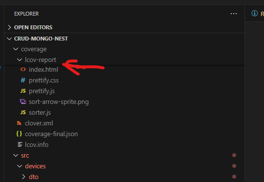
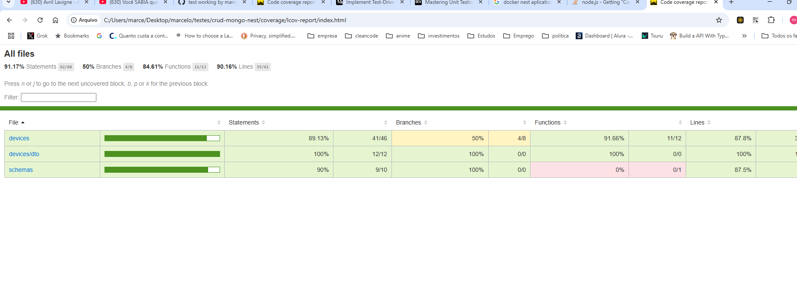

# CRUD Mongo Nest Application

## Running the Application

### Step 1: Build and Start the Application
Build and start the application:
```bash
docker compose up --build
```

---

## API Endpoints

### 1. Get All Devices
Retrieve a list of all devices:
```bash
curl --location 'http://localhost:3000/devices'
```

### 2. Get Device by ID
Fetch a specific device by its ID:
```bash
curl --location 'http://localhost:3000/devices/6820b602d8ca27f98f17d749'
```

### 3. Create a New Device
Create a new device with the following payload:
```bash
curl --location 'http://localhost:3000/devices' \
--header 'Content-Type: application/json' \
--data '{
  "name": "Device2",
  "brand": "bestBrand",
  "state": "available"
}'
```

### 4. Update a Device (Partial or Full)
Update a device's state or other properties:
```bash
curl --location --request PATCH 'http://localhost:3000/devices/6820b7630069b95c108dc5aa' \
--header 'Content-Type: application/json' \
--data '{
  "state": "in-use"
}'
```

---

## Running Coverage Tests

### Step 1: Stop Running Containers
Stop any running containers:
```bash
docker compose down
```

### Step 2: Run the Test Runner
Run the test runner:
```bash
docker-compose up test-runner
```

### Step 3: Generate the Coverage Report
Generate the coverage report:
```bash
docker cp test-runner:/app/coverage ./coverage
```

### Step 4: Open the Coverage Report
1. Navigate to the `coverage` folder.
2. Open the `lcov-report` folder.
3. Right-click on `index.html` and select "Copy Path" to view the report in your browser.



---

## Additional Resources

### Coverage Report

